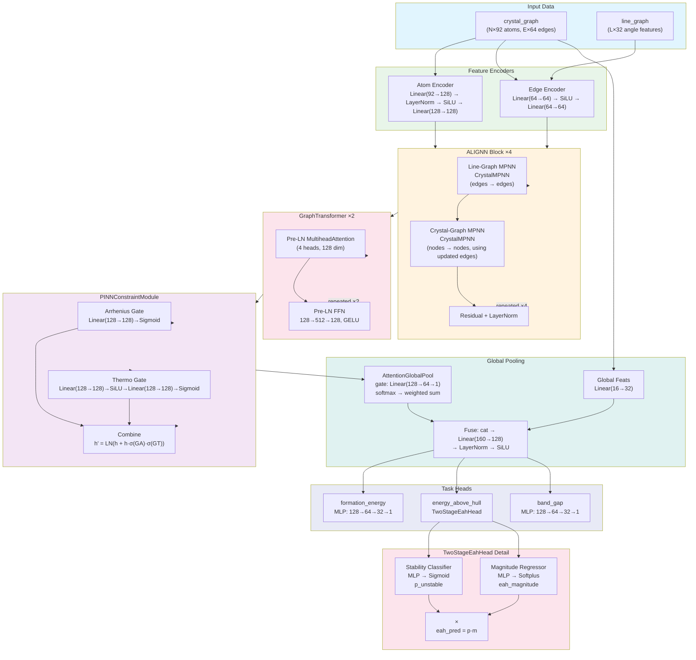

# Model Architecture — ScandiumPINNGNN

**Version:** v3-Li (hidden_dim=128, 4× ALIGNN, 2× Transformer)
**Total Parameters:** 1,281,321
**Model Size (fp32):** 4.9 MB
**File:** `src/models/scandium_model.py`

---

## 1. Architecture Overview

```
Input: crystal_graph (node_feats ∈ ℝᴺˣ⁹², edge_feats ∈ ℝᴱˣ⁶⁴, edge_index ∈ ℕ²ˣᴱ)
       line_graph     (lg_edge_feats ∈ ℝᴸˣ³², lg_edge_index ∈ ℕ²ˣᴸ)
                           │
                           ▼
┌─────────────────────────────────────────────────────────────────────┐
│  Atom Encoder                                                        │
│  Linear(92→128) → LayerNorm(128) → SiLU → Linear(128→128)          │
│  node_feats: N×92 → N×128                                            │
├─────────────────────────────────────────────────────────────────────┤
│  Edge Encoder                                                        │
│  Linear(64→64) → SiLU → Linear(64→64)                               │
│  edge_feats: E×64 → E×64                                             │
├─────────────────────────────────────────────────────────────────────┤
│  ALIGNN Layers × 4 (with gradient checkpointing)                     │
│  ┌───────────────────────────────────────────────────────────────┐   │
│  │  Line-Graph MPNN → Crystal-Graph MPNN (residual + LayerNorm)  │   │
│  └───────────────────────────────────────────────────────────────┘   │
│  node_feats: N×128 → N×128                                           │
│  edge_feats: E×64 → E×64                                             │
├─────────────────────────────────────────────────────────────────────┤
│  GraphTransformer Layers × 2                                         │
│  ┌───────────────────────────────────────────────────────────────┐   │
│  │  Pre-LN MHA(4 heads) + Residual → Pre-LN FFN(128→512→128)    │   │
│  │  + Residual                                                     │   │
│  └───────────────────────────────────────────────────────────────┘   │
│  node_feats: N×128 → N×128                                           │
├─────────────────────────────────────────────────────────────────────┤
│  PINNConstraintModule                                                │
│  ┌───────────────────────────────────────────────────────────────┐   │
│  │  h' = LayerNorm(h + h · σ(G_A) · σ(G_T))                      │   │
│  │  G_A: Linear(128→128)→Sigmoid  (Arrhenius gate)               │   │
│  │  G_T: Linear(128→128)→SiLU→Linear(128→128)→Sigmoid (Thermo)   │   │
│  └───────────────────────────────────────────────────────────────┘   │
│  node_feats: N×128 → N×128                                           │
├─────────────────────────────────────────────────────────────────────┤
│  AttentionGlobalPool                                                 │
│  ┌───────────────────────────────────────────────────────────────┐   │
│  │  gate = Linear(128→64)→SiLU→Linear(64→1)                      │   │
│  │  α = softmax(gate, batch)  →  h_graph = Σ(α · h_node)         │   │
│  └───────────────────────────────────────────────────────────────┘   │
│  graph_feats: N×128 → B×128                                          │
├─────────────────────────────────────────────────────────────────────┤
│  Global Feature Combiner                                             │
│  ┌───────────────────────────────────────────────────────────────┐   │
│  │  global_feat: Linear(16→32)→SiLU                               │   │
│  │  cat(graph_feats, global_encoded) → Linear(160→128)            │   │
│  │  → LayerNorm(128) → SiLU                                        │   │
│  └───────────────────────────────────────────────────────────────┘   │
│  graph_feats: B×128 → B×128                                          │
├─────────────────────────────────────────────────────────────────────┤
│  Task Heads                                                          │
│  ┌───────────────────────────────────────────────────────────────┐   │
│  │  formation_energy: Linear(128→64)→SiLU→Dropout→Linear(64→32)  │   │
│  │                    →SiLU→Linear(32→1) → squeeze                │   │
│  │                                                                   │   │
│  │  band_gap: same as above                                          │   │
│  │                                                                   │   │
│  │  energy_above_hull: TwoStageEahHead                               │   │
│  │    ├─ stability_head: MLP → Sigmoid → p_unstable                 │   │
│  │    ├─ magnitude_head: MLP → Softplus → eah_magnitude             │   │
│  │    └─ combined: eah_pred = p_unstable × eah_magnitude            │   │
│  └───────────────────────────────────────────────────────────────┘   │
│  predictions: B×1 each task                                          │
└─────────────────────────────────────────────────────────────────────┘
```

---

## 2. Component Details

### 2.1 Atom Encoder

```python
nn.Sequential(
    nn.Linear(atom_feat_dim=92, hidden_dim=128),
    nn.LayerNorm(128),
    nn.SiLU(),
    nn.Linear(128, 128),
)
```

| Layer | Input Shape | Output Shape | Parameters |
|-------|------------|-------------|-----------:|
| Linear | (N, 92) | (N, 128) | 92×128+128 = 11,904 |
| LayerNorm | (N, 128) | (N, 128) | 256 |
| SiLU | (N, 128) | (N, 128) | 0 |
| Linear | (N, 128) | (N, 128) | 128×128+128 = 16,512 |
| **Total** | | | **28,672** |

### 2.2 Edge Encoder

```python
nn.Sequential(
    nn.Linear(edge_feat_dim=64, 64),
    nn.SiLU(),
    nn.Linear(64, 64),
)
```

| Layer | Input Shape | Output Shape | Parameters |
|-------|------------|-------------|-----------:|
| Linear | (E, 64) | (E, 64) | 64×64+64 = 4,160 |
| SiLU | (E, 64) | (E, 64) | 0 |
| Linear | (E, 64) | (E, 64) | 64×64+64 = 4,160 |
| **Total** | | | **8,320** |

### 2.3 ALIGNN Layers (×4)

**File:** `src/models/gnn/alignn.py`

Each `ALIGNNLayer` performs alternating message passing:

```
1. Line-graph MPNN:   edge_feats' ← CrystalMPNN(edge_feats, line_graph_edges, lg_edge_feats)
2. Crystal-graph MPNN: node_feats' ← CrystalMPNN(node_feats, crystal_edges, edge_feats')
```

#### CrystalMPNN (per conv)

**File:** `src/models/gnn/layers.py:6`

```
Message:  m_ij = MLP([h_i || h_j || e_ij])     # concatenation → 2×Linear+SiLU
Update:   h_i' = LayerNorm(h_i + MLP([h_i || Σ_j m_ij]))
```

**Line-graph CrystalMPNN** (edge_dim=64 → edge_dim=64):

| Component | Layers | Parameters |
|-----------|--------|-----------:|
| message_nn | Linear(160→128) → SiLU → Linear(128→128) | 20,608 + 16,512 = 37,120 |
| update_nn | Linear(192→128) → SiLU → Linear(128→64) | 24,704 + 8,256 = 32,960 |
| LayerNorm | (64,) | 128 |
| **Subtotal** | | **70,208** |

**Crystal-graph CrystalMPNN** (node_dim=128, edge_dim=64):

| Component | Layers | Parameters |
|-----------|--------|-----------:|
| message_nn | Linear(320→128) → SiLU → Linear(128→128) | 41,088 + 16,512 = 57,600 |
| update_nn | Linear(256→128) → SiLU → Linear(128→128) | 32,896 + 16,512 = 49,408 |
| LayerNorm | (128,) | 256 |
| **Subtotal** | | **107,264** |

| Component | Parameters |
|-----------|-----------:|
| 1× ALIGNNLayer | 70,208 + 107,264 = **177,472** |
| **4× ALIGNN Layers** | **709,888** |

#### Message-Passing Equations

Let $\mathbf{h}_i^{(l)}$ be node features at layer $l$, $\mathbf{e}_{ij}^{(l)}$ be edge features between nodes $i$ and $j$.

**Line-graph convolution** (edges as nodes, bond angles as edge features):

$$\mathbf{m}_{ij}^{\text{(lg)}} = \text{MLP}_{\text{msg}}^{\text{(lg)}}\big([\mathbf{e}_i^{(l)} \,\|\, \mathbf{e}_j^{(l)} \,\|\, \mathbf{a}_{ij}]\big)$$

$$\mathbf{e}_i^{(l+1)} = \text{LayerNorm}\Big(\mathbf{e}_i^{(l)} + \text{MLP}_{\text{upd}}^{\text{(lg)}}\big([\mathbf{e}_i^{(l)} \,\|\, \sum_{j \in \mathcal{N}_i^{\text{lg}}} \mathbf{m}_{ij}^{\text{(lg)}}]\big)\Big)$$

**Crystal-graph convolution** (atoms as nodes, updated edges):

$$\mathbf{m}_{ij}^{\text{(cg)}} = \text{MLP}_{\text{msg}}^{\text{(cg)}}\big([\mathbf{h}_i^{(l)} \,\|\, \mathbf{h}_j^{(l)} \,\|\, \mathbf{e}_{ij}^{(l+1)}]\big)$$

$$\mathbf{h}_i^{(l+1)} = \text{LayerNorm}\Big(\mathbf{h}_i^{(l)} + \text{MLP}_{\text{upd}}^{\text{(cg)}}\big([\mathbf{h}_i^{(l)} \,\|\, \sum_{j \in \mathcal{N}_i^{\text{cg}}} \mathbf{m}_{ij}^{\text{(cg)}}]\big)\Big)$$

Where $\mathcal{N}_i^{\text{cg}}$ denotes crystal-graph neighbors (real-space bonds) and $\mathcal{N}_i^{\text{lg}}$ denotes line-graph neighbors (bond angles sharing a common central atom).

### 2.4 GraphTransformer Layers (×2)

**File:** `src/models/gnn/layers.py:76`

Pre-norm transformer with multi-head self-attention and position-wise FFN:

```
x ← LayerNorm(x + MultiheadAttention(x, x, x))
x ← LayerNorm(x + FFN(x))
```

| Component | Layers | Parameters |
|-----------|--------|-----------:|
| MultiheadAttention(128, 4) | in_proj (Q,K,V) + out_proj | 49,536 + 16,512 = 66,048 |
| LayerNorm (×2) | (128,) × 2 | 512 |
| FFN | Linear(128→512) → GELU → Dropout → Linear(512→128) → Dropout | 66,048 + 65,664 = 131,712 |
| **Per layer** | | **198,272** |
| **2× Layers** | | **396,544** |

### 2.5 PINNConstraintModule

**File:** `src/models/gnn/layers.py:100`

Learnable physics-informed gating applied element-wise to node features:

$$\mathbf{h}_i' = \text{LayerNorm}\big(\mathbf{h}_i + \mathbf{h}_i \cdot \sigma(\mathbf{g}_A) \cdot \sigma(\mathbf{g}_T)\big)$$

Where:
- $\mathbf{g}_A = \text{Linear}_{A}(\mathbf{h}_i)$ (Arrhenius gate)
- $\mathbf{g}_T = \text{Linear}_{T_1}(\mathbf{h}_i) \rightarrow \text{SiLU} \rightarrow \text{Linear}_{T_2}(\mathbf{h}_i)$ (thermodynamic gate)

| Component | Layers | Parameters |
|-----------|--------|-----------:|
| Arrhenius gate | Linear(128→128) → Sigmoid | 16,512 |
| Thermodynamic gate | Linear(128→128) → SiLU → Linear(128→128) → Sigmoid | 16,512 + 16,512 = 33,024 |
| LayerNorm | (128,) | 256 |
| **Total** | | **49,792** |

### 2.6 AttentionGlobalPool

**File:** `src/models/gnn/layers.py:119`

Soft-attention readout aggregating node features to graph-level representation:

$$\alpha_i = \frac{\exp(\mathbf{w}^\top \text{SiLU}(\mathbf{W} \mathbf{h}_i))}{\sum_{j \in \mathcal{G}_k} \exp(\mathbf{w}^\top \text{SiLU}(\mathbf{W} \mathbf{h}_j))}$$

$$\mathbf{h}_{\mathcal{G}_k} = \sum_{i \in \mathcal{G}_k} \alpha_i \mathbf{h}_i$$

| Layer | Input → Output | Parameters |
|-------|---------------|-----------:|
| Linear | (128)→(64) | 8,256 |
| SiLU | (64)→(64) | 0 |
| Linear | (64)→(1) | 65 |
| **Total** | | **8,321** |

### 2.7 Global Feature Combiner

16-dimensional global features (density, volume, symmetry number, lattice parameters, etc.) are encoded and fused with pooled graph features:

```python
self.global_feat_encoder = nn.Sequential(nn.Linear(16, 32), nn.SiLU())
self.global_combiner = nn.Sequential(
    nn.Linear(128 + 32, 128),  # cat(graph_feats, global_encoded)
    nn.LayerNorm(128),
    nn.SiLU(),
)
```

| Component | Parameters |
|-----------|-----------:|
| global_feat_encoder | 16×32+32 = 544 |
| global_combiner | (160×128+128) + 256 = 20,608 |
| **Total** | **21,152** |

### 2.8 Task Heads

#### Standard MLP Head (formation_energy, band_gap)

```python
nn.Sequential(
    nn.Linear(128, 64), nn.SiLU(), nn.Dropout(0.15),
    nn.Linear(64, 32), nn.SiLU(),
    nn.Linear(32, 1),
)
```

| Layer | Parameters |
|-------|-----------:|
| Linear(128→64) | 8,256 |
| Linear(64→32) | 2,080 |
| Linear(32→1) | 33 |
| **Per head** | **10,369** |
| **2 heads** | **20,738** |

#### TwoStageEahHead (energy_above_hull)

**File:** `src/models/heads/two_stage_eah.py:14`

Decomposes EaH prediction into stability classification + magnitude regression:

```
Stage 1: p_unstable = σ(MLP(128→64→32→1))
Stage 2: eah_magnitude = Softplus(MLP(128→64→32→1))
Combined: eah_pred = p_unstable × eah_magnitude
```

| Component | Layers | Parameters |
|-----------|--------|-----------:|
| stability_head | Linear(128→64), LayerNorm(64), SiLU, Dropout, Linear(64→32), SiLU, Linear(32→1) | 8,256 + 128 + 2,080 + 33 = 10,497 |
| magnitude_head | same as above + Softplus | 10,497 |
| uncertainty_head | Linear(128→32), SiLU, Linear(32→1) | 4,128 + 33 = 4,161 |
| **Total** | | **25,155** |

#### Uncertainty Heads

Per-task MLP for heteroscedastic aleatoric uncertainty:

| Component | Parameters |
|-----------|-----------:|
| Per task: Linear(128→32)→SiLU→Linear(32→1) | 4,161 |
| **3 tasks** | **12,483** |

---

## 3. Parameter Count Summary

| Component | Parameters | % of Total |
|-----------|-----------:|-----------:|
| Atom Encoder | 28,672 | 2.2% |
| Edge Encoder | 8,320 | 0.6% |
| ALIGNN Layers (×4) | 709,888 | 55.4% |
| GraphTransformer Layers (×2) | 396,544 | 31.0% |
| PINNConstraintModule | 49,792 | 3.9% |
| AttentionGlobalPool | 8,321 | 0.6% |
| Global Feature Combiner | 21,152 | 1.7% |
| Task Heads (formation_energy) | 10,369 | 0.8% |
| Task Heads (band_gap) | 10,369 | 0.8% |
| Task Heads (TwoStageEaH) | 25,155 | 2.0% |
| Uncertainty Heads (×3) | 12,483 | 1.0% |
| **Total** | **1,281,321** | **100%** |

Distribution by module family:

```
ALIGNN layers        ████████████████████████████████████████ 55.4%
Transformer layers   ████████████████████                     31.0%
PINN module          ███                                       3.9%
All task heads       ███                                       4.6%
Encoders + pool      ███                                       5.1%
```

---

## 4. Forward Pass Walkthrough

### Input Shapes

| Tensor | Shape | Description |
|--------|-------|-------------|
| `crystal_graph.x` | (N, 92) | Atom features (padded to 92-dim) |
| `crystal_graph.edge_index` | (2, E) | Edge source/dest indices |
| `crystal_graph.edge_attr` | (E, 64) | Bessel RBF edge features |
| `crystal_graph.global_feat` | (B, 16) | Global structure features |
| `crystal_graph.batch` | (N,) | Per-node batch assignment |
| `line_graph.edge_index` | (2, L) | Line-graph edge indices |
| `line_graph.edge_attr` | (L, 32) | Spherical Bessel RBF angle features |

Where for a batch of 16 graphs:
- N ≈ 800 nodes total (avg 50 atoms/crystal × 16)
- E ≈ 12,800 edges total (avg 50×16×16 = 800 neighbors/crystal, but limited to max 16 neighbors)
- L ≈ 192,000 line-graph edges (avg 800 edges/crystal → ~12,000 edges in line graph × 16)

### Step-by-Step Shapes

| Step | Operation | Shape Transformation |
|------|-----------|-------------------:|
| 1 | Atom encoder | (N, 92) → (N, 128) |
| 2 | Edge encoder | (E, 64) → (E, 64) |
| 3 | ALIGNN ×4 (with GC) | (N, 128), (E, 64) → (N, 128), (E, 64) |
| 4 | Unsqueeze | (N, 128) → (1, N, 128) |
| 5 | GraphTransformer ×2 (pre-norm MHA + FFN) | (1, N, 128) → (1, N, 128) |
| 6 | Squeeze | (1, N, 128) → (N, 128) |
| 7 | PINNConstraintModule | (N, 128) → (N, 128) |
| 8 | AttentionGlobalPool | (N, 128) → (B, 128) |
| 9 | Global feat encoder | (B, 16) → (B, 32) |
| 10 | Concatenate | (B, 128) + (B, 32) → (B, 160) |
| 11 | Global combiner | (B, 160) → (B, 128) |
| 12 | Task heads (×3) | (B, 128) → (B,) each |

### Memory During Forward Pass (per batch)

| Stage | Activations | Cumulative (GC on) | Cumulative (GC off) |
|-------|:-----------:|:------------------:|:-------------------:|
| Input batch | ~61 MB | 61 MB | 61 MB |
| After encoders | ~10 MB | 71 MB | 71 MB |
| Per ALIGNN layer | ~15 MB | 86 MB | 221 MB |
| After 4 ALIGNN | ~15 MB | 131 MB | 671 MB |
| Transformer (×2) | ~10 MB | 151 MB | 691 MB |
| PINN + Pool | ~5 MB | 157 MB | 697 MB |
| Overhead + temp | ~313 MB | **470 MB** | **1,127 MB** |

### Peak Memory: 470 MB (with GC) vs 1,127 MB (without GC)

GC trades 33% compute time for 2.4× memory savings:
- With GC: 1,253 ms/step → 12.8 graphs/s
- Without GC: 943 ms/step → 17.0 graphs/s

---

## 5. Mermaid Architecture Diagram



---

## 6. Tensor Shape Flow (Batch=16)

```
┌───────────────────────────────────────────────────────────────┐
│ INPUT                                                         │
│ crystal_graph.x:         [~800, 92]      ~294 KB              │
│ crystal_graph.edge_index: [2, ~12,800]   ~205 KB              │
│ crystal_graph.edge_attr: [~12,800, 64]   ~3.1 MB              │
│ line_graph.edge_attr:    [~192,000, 32]  ~24.6 MB             │
│ line_graph.edge_index:   [2, ~192,000]   ~3.1 MB              │
├───────────────────────────────────────────────────────────────┤
│ ENCODERS                                                      │
│ node_feats:  [~800, 128]    ~410 KB       atom_encoder       │
│ edge_feats:  [~12,800, 64]  ~3.1 MB       edge_encoder       │
├───────────────────────────────────────────────────────────────┤
│ ALIGNN LAYERS (×4)                                            │
│ node_feats:  [~800, 128]    ~410 KB       (per layer)        │
│ edge_feats:  [~12,800, 64]  ~3.1 MB       (per layer)        │
│ GC: only input saved; activations recomputed in backward      │
├───────────────────────────────────────────────────────────────┤
│ GRAPH TRANSFORMER (×2)                                        │
│ node_feats:  [1, ~800, 128] ~410 KB       (unsqueezed)       │
│ attn weights: [1, 4, ~800, ~800] ~10 MB   (if saved)         │
│ FFN hidden:   [1, ~800, 512] ~1.6 MB                          │
├───────────────────────────────────────────────────────────────┤
│ PINN CONSTRAINT MODULE                                        │
│ node_feats:  [~800, 128]    ~410 KB                            │
├───────────────────────────────────────────────────────────────┤
│ ATTENTION POOL                                                │
│ gate: [~800, 1]  ~3 KB                                        │
│ graph_feats: [16, 128]  ~8 KB                                 │
├───────────────────────────────────────────────────────────────┤
│ GLOBAL FEATURE COMBINER                                       │
│ global_feat: [16, 16]   ~1 KB                                  │
│ graph_feats: [16, 128]  ~8 KB                                 │
├───────────────────────────────────────────────────────────────┤
│ TASK HEADS                                                    │
│ formation_energy:     [16]  ~128 bytes                         │
│ energy_above_hull:    [16]  ~128 bytes                         │
│ band_gap:            [16]  ~128 bytes                          │
│ p_unstable:          [16]  ~128 bytes                          │
│ eah_magnitude:       [16]  ~128 bytes                          │
└───────────────────────────────────────────────────────────────┘
```

---

## 7. Memory Analysis

### 7.1 Model Weights (fp32)

| Component | Size |
|-----------|-----:|
| Parameters (1,281,321 × 4 bytes) | 4.9 MB |
| Optimizer states (AdamW: 2× params) | 9.8 MB |
| Gradients (1× params) | 4.9 MB |
| **Total static** | **19.6 MB** |

### 7.2 Peak VRAM Breakdown

| Component | With GC | Without GC |
|-----------|--------:|-----------:|
| Model parameters | 4.9 MB | 4.9 MB |
| Optimizer states | 9.8 MB | 9.8 MB |
| Gradients | 4.9 MB | 4.9 MB |
| Input batch (crystal + line graph) | ~61 MB | ~61 MB |
| ALIGNN activations (4 layers) | ~20 MB | ~320 MB |
| Transformer activations (2 layers) | ~30 MB | ~160 MB |
| PINN + pool activations | ~5 MB | ~20 MB |
| CUDA kernels + temp buffers | ~334 MB | ~546 MB |
| **Peak VRAM** | **~470 MB** | **~1,127 MB** |

### 7.3 Gradient Checkpointing Tradeoff

| Config | VRAM | Throughput | Step Time |
|--------|-----:|-----------:|----------:|
| GC enabled | 470 MB | 12.8 graphs/s | 1,253 ms |
| GC disabled | 1,127 MB | 17.0 graphs/s | 943 ms |

GC saves **2.4× VRAM** at **33% speed cost** — essential for 4 GB GPUs.

---

## 8. Uncertainty Quantification

### 8.1 MC Dropout Inference

**File:** `src/models/scandium_model.py:201`

```python
def predict_with_mc_dropout(self, crystal_graph, line_graph):
    self.train()  # enable dropout
    all_preds = {task: [] for task in self.tasks}
    with torch.no_grad():
        for _ in range(self.mc_dropout_samples):  # default 20
            preds = self.forward(crystal_graph, line_graph)
            for task in self.tasks:
                all_preds[task].append(preds[task])
    self.eval()
    return {
        task: {"mean": stacked.mean(0), "std": stacked.std(0), "samples": stacked}
        for task in self.tasks
    }
```

### 8.2 Heteroscedastic (Aleatoric) Uncertainty

Per-task MLP heads predicting log-variance:

```python
self.uncertainty_heads[task] = nn.Sequential(
    nn.Linear(128, 32), nn.SiLU(), nn.Linear(32, 1)
)
# Output: log_var → uncertainty = exp(0.5 * log_var)
```

Available when `return_uncertainty=True` is passed to `forward()`.

---

## 9. Reproducibility

Training uses deterministic seed 42 with `torch.set_rng_state()` capture/restore:

- **Seed:** 42 (all RNG: torch CPU, torch CUDA, numpy, random)
- **Deterministic algorithms:** enabled where possible
- **Full state capture** in checkpoints: RNG states, optimizer state, GradScaler state, GradNorm weights

---

## 10. Key Design Decisions

| Decision | Rationale |
|----------|-----------|
| ALIGNN backbone | Captures both pairwise distances AND bond angles via line graph |
| Gradient checkpointing | Essential for 4 GB GPU; 33% speed cost for 2.4× VRAM |
| Two-stage EaH head | Solves collapse-to-zero (~70% of EaH targets ≈ 0) |
| Attention pooling | Learnable soft-attention outperforms mean/max pooling for crystal graphs |
| Global feature concatenation | Injects explicit structural information (density, symmetry, lattice params) |
| SiLU activation | Self-gating property; empirically better than ReLU for GNNs |
| Pre-norm transformer | More stable training than post-norm at deeper stacks |
| MC Dropout (20) | Epistemic uncertainty without training separate ensembles |
