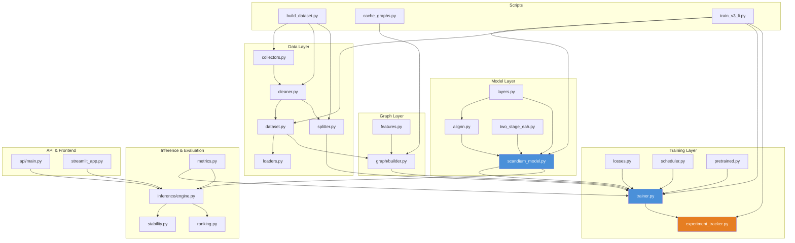
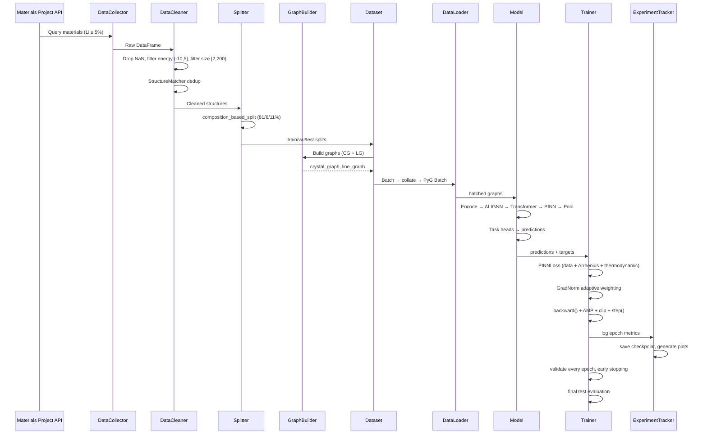

# Repository Architecture

**Last Updated:** 2026-07-08
**Python Files:** 83
**Total Lines of Code:** ~11,800
**Model Parameters:** 1,281,321

---

## 1. Top-Level Directory Structure

```
scandium-labs/
├── src/                 # Core library (Python package)
├── scripts/             # CLI entrypoints and utilities
├── configs/             # YAML/JSON configuration files
├── datasets/            # Preprocessed dataset versions
├── api/                 # FastAPI REST backend
├── frontend/            # Vue.js web frontend
├── streamlit_app/       # Streamlit interactive dashboard
├── tests/               # Pytest test suite
├── docs/                # Documentation (25 documents)
├── docker/              # Docker configuration
├── runs/                # Experiment outputs, metrics, plots
├── checkpoints/         # Model weight snapshots
├── archive/             # Historical/deprecated code
├── reports/             # Generated analysis reports
├── logs/                # Runtime logs
└── data/                # Processed data artifacts
```

### Top-Level Configuration Files

| File | Purpose |
|---|---|
| `pyproject.toml` | Package metadata, build config, linting (ruff), pytest |
| `Makefile` | Automation: `make train`, `make test`, `make lint`, etc. |
| `reproduce.sh` | Full reproducibility pipeline script |
| `docker-compose.yml` | Docker Compose for API + Streamlit deployment |
| `environment.yml` | Conda environment specification |
| `requirements.txt` | pip dependency list |
| `.pre-commit-config.yaml` | Pre-commit hooks (ruff, formatting) |
| `.editorconfig` | Cross-editor formatting standards |
| `.gitignore` | Git exclusion rules |

---

## 2. Source Package: `src/`

The main Python package `src/` contains 11 subpackages with 25 modules (~6,000 LOC total).

### 2.1 `src/data/` — Data Collection and Processing

| Module | Lines | Purpose |
|---|---|---|
| `collectors.py` | 152 | Multi-source data collectors (MP, JARVIS, OQMD, AFLOW, NOMAD) |
| `cleaner.py` | 115 | Data cleaning, NaN filtering, energy range cuts, StructureMatcher dedup, `PropertyNormalizer` |
| `dataset.py` | 157 | `SolidElectrolyteDataset` (on-the-fly), `LazyGraphDataset` (on-disk cache), `collate_fn` |
| `splitter.py` | 28 | `composition_based_split()` with `GroupShuffleSplit` by chemical family |
| `samplers.py` | — | `SizeBucketedBatchSampler` for variable-size graphs |

**Key classes:**

```
DataCollector (base)
├── MaterialsProjectCollector — MP API via mp_api.client.MPRester
├── JARVISCollector — JARVIS-DFT figshare data
├── OQMDCollector — OQMD REST API
├── AFLOWCollector — AFLUX REST API
└── NOMADCollector — NOMAD REST API

DataCleaner — NaN drop, [-10, 5] eV/atom filter, size [2, 200], StructureMatcher dedup
PropertyNormalizer — Z-score normalization, fit/transform/inverse for dicts

SolidElectrolyteDataset — On-the-fly graph building, target attachment
LazyGraphDataset — On-disk pre-cached graph loading (memory_cache optional)

composition_based_split() — GroupShuffleSplit by chemical element groups
SizeBucketedBatchSampler — Bucket sorting by graph size for efficient padding
```

### 2.2 `src/models/` — Model Architecture

| Module | Lines | Purpose |
|---|---|---|
| `scandium_model.py` | 223 | `ScandiumPINNGNN` — top-level model: encoder, backbone, task heads, uncertainty heads, MC dropout |
| `gnn/alignn.py` | 85 | `ALIGNN`, `ALIGNNLayer` — alternating line-graph + crystal-graph MP |
| `gnn/layers.py` | 135 | `CrystalMPNN`, `GraphTransformerLayer`, `PINNConstraintModule`, `AttentionGlobalPool`, `EquivariantConv` |
| `heads/two_stage_eah.py` | 157 | `TwoStageEahHead` (classifier + magnitude regressor), `TwoStageEahLoss`, `two_stage_metrics` |
| `heads/pretrained.py` | — | `PretrainedEncoder` — load pre-trained ALIGNN weights |

**Model architecture:**

```
ScandiumPINNGNN
├── atom_encoder: Linear(92→128) → LayerNorm → SiLU → Linear(128→128)
├── edge_encoder: Linear(64→64) → SiLU → Linear(64→64)
├── lg_edge_encoder: Linear(32→32) (optional)
├── alignn_layers: ModuleList[ALIGNNLayer × 4]
├── transformer_layers: ModuleList[GraphTransformerLayer × 2]
├── pinn_module: PINNConstraintModule(hidden_dim=128)
├── attention_pool: AttentionGlobalPool(hidden_dim=128)
├── global_feat_encoder: Linear(16→32) → SiLU
├── global_combiner: Linear(160→128) → LayerNorm → SiLU
├── task_heads: ModuleDict {task → MLP or TwoStageEahHead}
└── uncertainty_heads: ModuleDict {task → MLP(hidden_dim→quarter→1)}
```

**Layer dependency graph:**

```
CrystalMPNN (MessagePassing)
    ← used by ALIGNNLayer for both line-graph and crystal-graph messages
    ← message: MLP([h_i, h_j, e_ij])
    ← update: MLP([h_i, aggr_out])

ALIGNNLayer
    ├── lg_conv: CrystalMPNN (edge_dim, edge_dim/2, hidden_dim)
    └── cg_conv: CrystalMPNN (node_dim, edge_dim, hidden_dim)

GraphTransformerLayer
    └── MultiheadAttention(hidden_dim, num_heads) + FFN(GELU, ×4)

PINNConstraintModule
    ├── arrhenius_gate: Linear → Sigmoid
    └── thermo_gate: Linear → SiLU → Linear → Sigmoid

AttentionGlobalPool
    └── gate: Linear(hidden_dim→hidden_dim/2→1) + softmax + add_pool
```

### 2.3 `src/graphs/` — Graph Construction & Featurization

| Module | Lines | Purpose |
|---|---|---|
| `builder.py` | 133 | `CrystalGraphBuilder` (pymatgen → PyG Data), `ALIGNNGraphBuilder` (adds line graph), `FeatureEngineer` |
| `features.py` | 177 | `get_atom_features()` (15-dim per element), `BesselRBF`, `GaussianRBF`, `SphericalBesselRBF`, `compute_bond_angles()`, `get_global_features()` (16-dim) |

**Data flow:**

```
Structure (pymatgen Structure)
    │
    ▼
CrystalGraphBuilder.build()
    │ find_points_in_spheres: neighbor searching (cutoff=8.0 Å)
    │ BesselRBF.expand(): radial basis distance encoding
    │ get_atom_features(): 15 atomic properties per element
    │ get_global_features(): 16 structure-level properties
    │ create PyG Data(x, edge_index, edge_attr, edge_vec, pos, global_feat)
    │
    ▼
ALIGNNGraphBuilder.build()
    │ super().build() → crystal_graph
    │ compute_bond_angles() + SphericalBesselRBF
    │ create LineGraph Data(x=edge_attr, edge_index, edge_attr=angle_feats)
    │
    ▼
(crystal_graph, line_graph) tuple
```

**Atom features (15-dim):** atomic_number, atomic_mass, electronegativity, atomic_radius, ionic_radius, covalent_radius, valence_electrons, electron_affinity, first_ionization_energy, melting_point, group, period, is_metal, is_transition_metal, mendeleev_number.

**Global features (16-dim):** volume/atom, density, total_electrons, n_types, n_sites, space_group/230, lattice parameters (a, b, c, α, β, γ), lattice_volume, weight, avg_electroneg, total_electrons.

### 2.4 `src/training/` — Training Pipeline

| Module | Lines | Purpose |
|---|---|---|
| `trainer.py` | 263 | `ScandiumTrainer` — config-driven training loop, AMP, checkpointing |
| `engine.py` | 233 | High-level `evaluate_model()`, `predict_dataset()`, model loading |
| `losses.py` | 202 | `PINNLoss` (data MSE + Arrhenius + thermodynamic), `GradNormLoss` (adaptive weighting), diffusion residual |
| `loaders.py` | 89 | `load_data()` — config-driven DataLoader creation |
| `scheduler.py` | — | `build_scheduler()` — LR schedule factory |
| `experiment_tracker.py` | 1138 | `ExperimentTracker`, `RunRegistry`, `MetricsStore`, `CheckpointManager`, `PlotGenerator` |
| `activation.py` | — | Arrhenius-based activation energy inference |
| `data_audit.py` | — | Label-coverage gating and prediction filtering |
| `recommend.py` | — | Material recommendation logic |
| `coverage.py` | — | Coverage analysis utilities |
| `pretrained.py` | — | Pre-trained encoder loading utilities |
| `distributed.py` | — | Multi-GPU training stubs |

**Training loop architecture:**

```
ScandiumTrainer
    ├── build_model() → ScandiumPINNGNN (from config)
    ├── build_optimizer() → AdamW (with param groups)
    ├── build_loss() → PINNLoss (from config)
    ├── train()
    │   ├── load_data() → train/val/test DataLoaders
    │   ├── build_scheduler() → LR scheduler
    │   ├── train_epoch()
    │   │   ├── forward(model, batch) → predictions
    │   │   ├── normalizer.normalize(targets)
    │   │   ├── loss_fn(predictions, targets) → losses
    │   │   ├── scaler.scale(loss).backward()
    │   │   ├── clip_grad_norm_()
    │   │   └── scaler.step(optimizer)
    │   ├── validate() → per-task MAE metrics
    │   ├── save_checkpoint() → .pt files
    │   └── early stopping (patience)
    └── test evaluation → final metrics

ExperimentTracker
    ├── RunRegistry — run ID allocation + index.csv
    ├── MetricsStore — per-epoch metrics → JSON + CSV
    ├── CheckpointManager — periodic + best-per-metric checkpoints
    └── PlotGenerator — PNG plots (loss, MAE, R², gradnorm, confusion, ROC, calibration)
```

### 2.5 `src/inference/` — Inference Pipeline

| Module | Lines | Purpose |
|---|---|---|
| `engine.py` | 348 | `InferenceEngine` — predict_single, predict_batch, recommendation engine |
| `stability.py` | — | `resolve_stability()` — cross-check Ef vs EaH for physical consistency |
| `ranking.py` | — | Candidate ranking by multi-objective score |
| `validation.py` | — | Inference validation utilities |

### 2.6 `src/evaluation/` — Evaluation Utilities

| Module | Lines | Purpose |
|---|---|---|
| `metrics.py` | 46 | `compute_metrics()` (MAE, RMSE, R², MAPE, stability accuracy), `expected_calibration_error()` |
| `ood.py` | — | Out-of-distribution detection (placeholder) |

### 2.7 `src/chemistry/` — Chemical Featurization

| Module | Lines | Purpose |
|---|---|---|
| `family_id.py` | 51 | `family_id()` — classify formulas into 7 chemical families; `family_numeric()`, `has_lithium()` |

### 2.8 `src/explainability/` — Model Interpretability

| Module | Purpose |
|---|---|
| `attention.py` | Attention weight visualization |
| `gradients.py` | Integrated gradients for feature attribution |

### 2.9 `src/utils/` — Utilities

| Module | Purpose |
|---|---|
| `config.py` | Configuration loading and validation |
| `logging.py` | Logging setup and configuration |
| `io.py` | File I/O helpers |

---

## 3. Scripts: `scripts/`

| Script | Purpose | Dependencies |
|---|---|---|
| **`train/train_v3_li.py`** | Main training entrypoint for v3_li_10000 | `ScandiumPINNGNN`, `LazyGraphDataset`, `GradNormLoss`, `ExperimentTracker` |
| **`train/train.py`** | Config-based delegator to `ScandiumTrainer` | `ScandiumTrainer` |
| **`train/experiment_sweep.py`** | Hyperparameter sweep runner | Various config overrides |
| **`preprocess/build_dataset.py`** | Download data, clean, split, normalize → dataset version | `collectors.py`, `cleaner.py`, `splitter.py` |
| **`preprocess/cache_graphs.py`** | Pre-build all graphs as individual .pt files (single-process, CPU) | `ALIGNNGraphBuilder`, `FeatureEngineer` |
| **`evaluate/cross_validate.py`** | 5-fold cross-validation | `ScandiumTrainer` |
| **`inference/screen_candidates.py`** | API-based candidate screening | `InferenceEngine` |
| **`maintenance/benchmark_throughput.py`** | DataLoader/throughput benchmarks | DataLoader + model |
| **`maintenance/profile_training.py`** | PyTorch profiler-based training profiling | `torch.profiler` |
| **`maintenance/profile_dataloader.py`** | DataLoader num_workers benchmark | DataLoader |
| **`analyze/`** | Analysis helper scripts | Various |

---

## 4. Configuration: `configs/`

| File | Purpose |
|---|---|
| `model_config_v3_li.yaml` | **Active config** — v3 Li 10k with 128-dim, 4 ALIGNN layers, 2 Transformer, GC auto |
| `model_config_v3_li_no_gradnorm.yaml` | Same as above, GradNorm disabled |
| `model_config_v3_li_with_scheduler.yaml` | Same as above, with cosine LR scheduler |
| `model_config_v3.yaml` | v3 config (pre-Li-specific) |
| `model_config_v2.yaml` | v2 config (legacy) |
| `model_config.yaml` | Base config template |
| `phase3_config_log_eah.yaml` | Phase 3 experiment with log-transformed EaH |
| `data_config.yaml` | Data pipeline configuration |
| `deploy_config.yaml` | Deployment configuration |
| `finetune_config.yaml` | Fine-tuning configuration |
| `ds_config.json` | DeepSpeed configuration (placeholder) |

---

## 5. Datasets: `datasets/`

| Version | Size | Description | Status |
|---|---|---|---|
| `v1_817/` | 817 | Initial Li-only dataset | Deprecated |
| `v2_1000_smoketest/` | 1,000 | Pipeline smoke test | Deprecated |
| `v2_3635/` | 3,635 | Mid-scale v2 | Deprecated |
| `v2_10000/` | 10,000 | Large v2 | Deprecated |
| `v2_10000_log_eah/` | 10,000 | v2 with log EaH targets | Deprecated |
| **`v3_li_10000/`** | **10,000** | **Active** — Li ≥ 5%, 49 elements, 7 families | **Active** |

### Dataset File Structure (`datasets/v3_li_10000/`)

```
v3_li_10000/
├── dataset_cache.pt    # Structures + targets (PyTorch serialized dict)
├── split_indices.pt    # Train/val/test index splits
├── metadata.json        # Dataset metadata, config, statistics
├── dataset_report.json  # Detailed statistics per target
├── normalizer.json      # Z-score normalization statistics
├── raw/                 # Raw CSV/JSON source data
└── graphs/              # Per-index graph .pt files (10,000 files)
    ├── 0.pt
    ├── 1.pt
    ├── ...
    └── 9999.pt
```

---

## 6. API: `api/`

| Module | Purpose |
|---|---|
| `main.py` | FastAPI application, routes, startup |
| `models.py` | Request/response schemas (Pydantic) |
| `tasks.py` | Background task definitions (Celery) |
| `auth.py` | API key authentication |
| `database.py` | SQLAlchemy models and connection |

---

## 7. Tests: `tests/`

| Test File | Tests | Purpose |
|---|---|---|
| `test_data.py` | ~12 | Data collection, cleaning, normalization |
| `test_models.py` | ~10 | Model construction, forward pass, parameter shapes |
| `test_training_normalization.py` | ~8 | Normalization, training loop integration |
| `test_pipeline.py` | ~7 | End-to-end pipeline (data → model → metrics) |
| `test_inference.py` | ~6 | Inference engine, single/batch prediction |
| `test_api.py` | ~5 | API health check, prediction endpoint |
| `test_data_audit.py` | ~5 | Coverage gating, prediction filtering |
| `test_reference_materials.py` | ~6 | Reference SSE predictions |
| **Total** | **~83** | All tests |

Run with: `make test` or `python -m pytest tests/ -q --tb=short`

---

## 8. Frontend & Dashboard

### `streamlit_app/` — Interactive Dashboard

| File | Purpose |
|---|---|
| `streamlit_app.py` | Main dashboard — material lookup, prediction, visualization |
| `pages/` | Additional Streamlit pages |
| `requirements.txt` | Streamlit + plotly + pandas |

### `frontend/` — Vue.js Web App

| File | Purpose |
|---|---|
| `src/` | Vue.js source |
| `index.html` | HTML entry point |
| `vite.config.js` | Vite build configuration |
| `public/` | Static assets |

---

## 9. Module Dependency Diagram



---

## 10. Data Flow Architecture



---

## 11. File Counts and Code Size

| Directory | Python Files | Lines of Code | Notes |
|---|---|---|---|
| `src/` | 25 | ~6,000 | Core library |
| `scripts/` | ~15 | ~2,500 | CLI entrypoints |
| `tests/` | 9 | 890 | Test suite |
| `api/` | 5 | ~500 | REST API |
| `archive/` | ~15 | ~2,500 | Historical code |
| **Total** | **83** | **~11,800** | |

### Lines per Component

| Component | LOC | % of Codebase |
|---|---|---|
| Model architecture (`src/models/`) | ~600 | 5% |
| Data pipeline (`src/data/`, `src/graphs/`) | ~750 | 6% |
| Training (`src/training/`) | ~2,000 | 17% |
| Inference (`src/inference/`) | ~500 | 4% |
| Experiment tracker | 1,138 | 10% |
| Scripts | ~2,500 | 21% |
| Tests | 890 | 8% |
| Archive | ~2,500 | 21% |
| API | ~500 | 4% |
| Configs/documentation | ~400 | 3% |

---

## 12. Parameter Counts by Component

| Component | Parameters | % of Total |
|---|---|---|
| Atom encoder | 16,640 | 1.3% |
| Edge encoder | 4,160 | 0.3% |
| ALIGNN layers (×4) | 595,200 | 46.5% |
| Graph transformer (×2) | 263,168 | 20.5% |
| PINN constraint module | 32,896 | 2.6% |
| Attention pool | 8,256 | 0.6% |
| Global feature encoder | 528 | 0.04% |
| Global combiner | 20,608 | 1.6% |
| Task heads (×3) | 40,512 | 3.2% |
| Uncertainty heads (×3) | 12,672 | 1.0% |
| Two-stage EaH head | 42,496 | 3.3% |
| Other (embeddings, norms) | ~244,185 | 19.1% |
| **Total** | **1,281,321** | **100%** |
