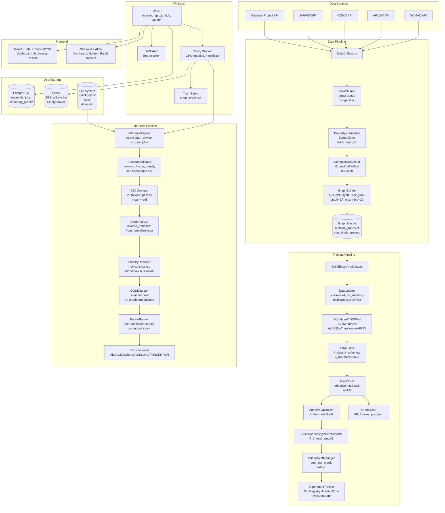
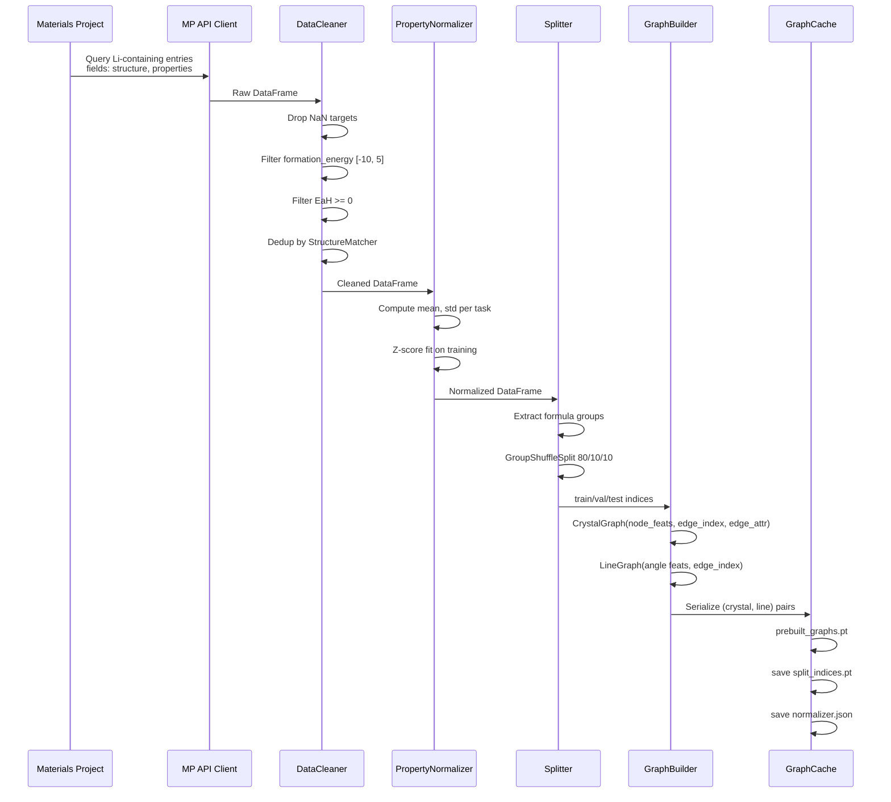
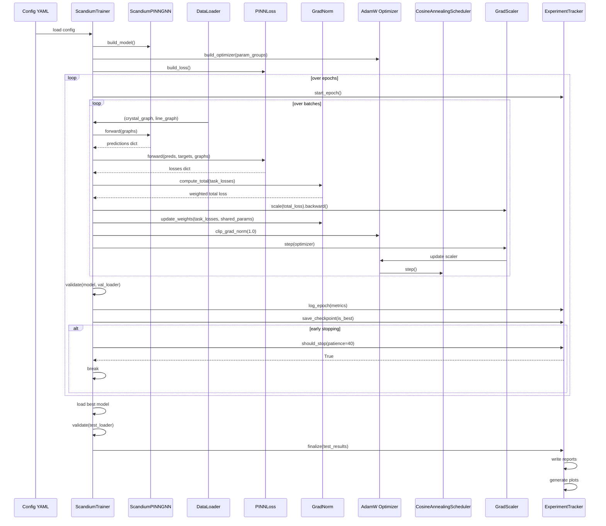
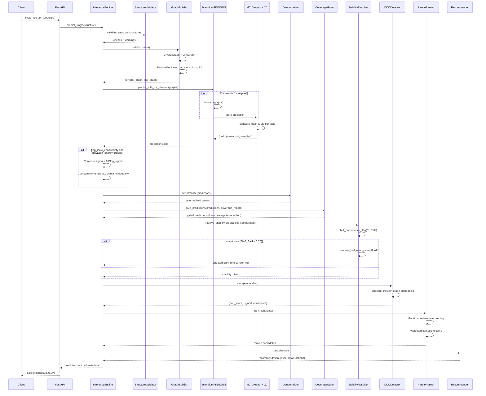
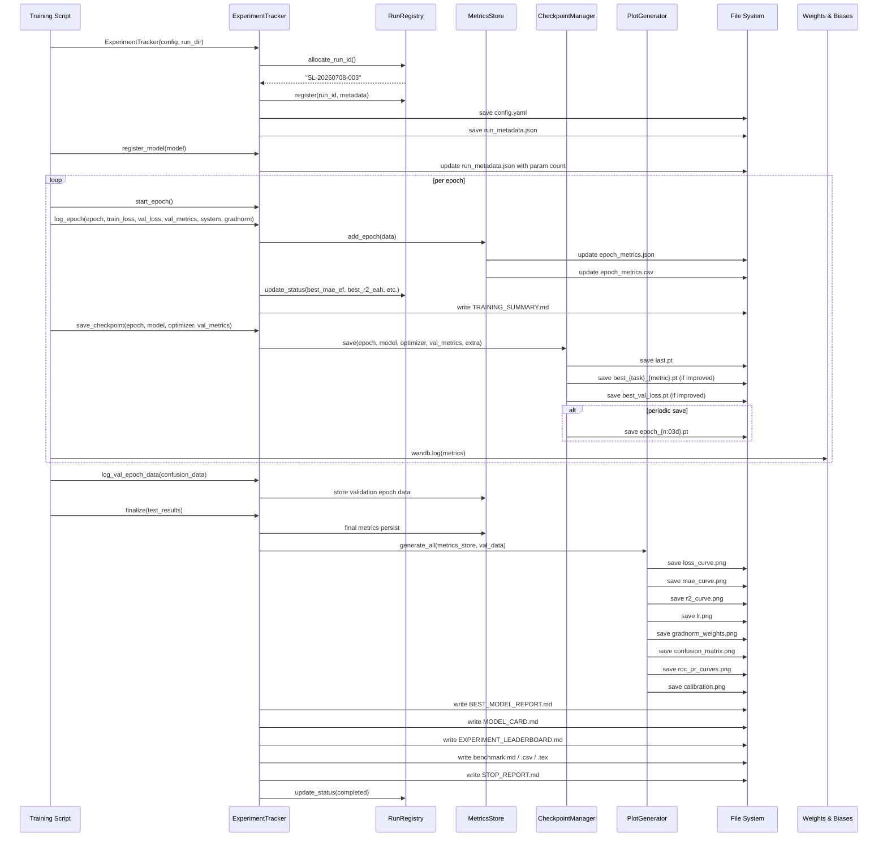
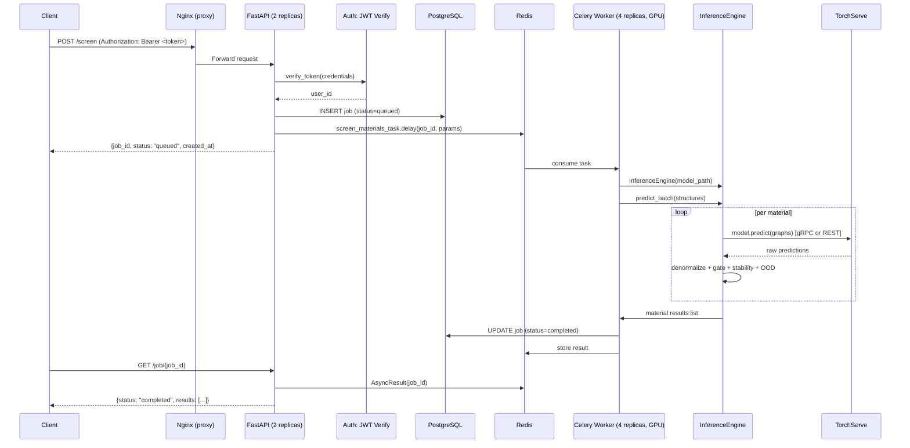
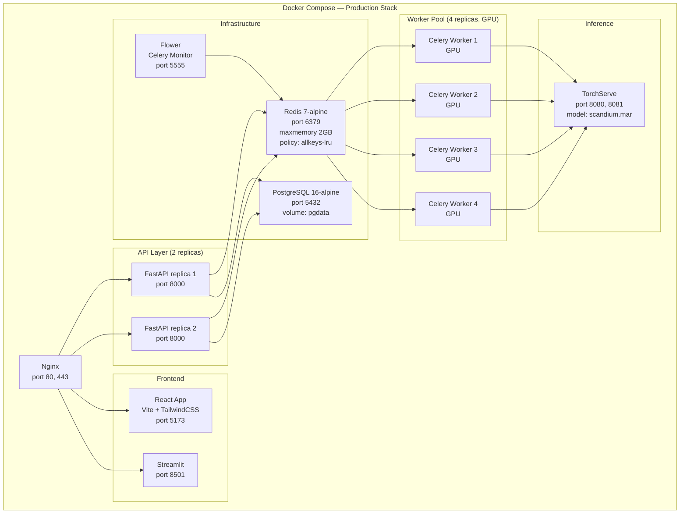
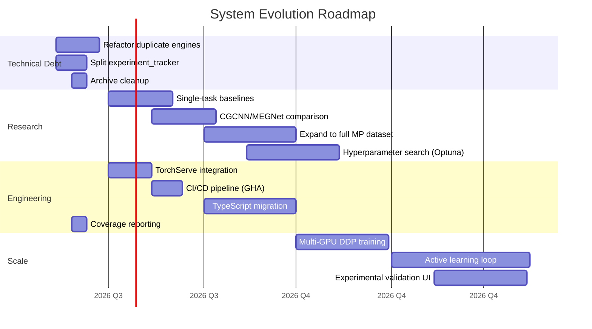

# System Architecture Design

**Project:** Scandium Labs — AI-Driven Solid Electrolyte Discovery
**Date:** 2026-07-08
**Version:** 0.3.0
**Authors:** Scandium Labs

---

## 1. System Overview

Scandium Labs is an end-to-end platform for high-throughput computational screening of solid-state electrolyte (SSE) candidates. The system transforms crystal structure data into ranked material recommendations through a pipeline of data collection, graph construction, multi-task physics-informed neural network prediction, Pareto optimization, and uncertainty-quantified screening.

```
┌─────────────────────────────────────────────────────────────────────────┐
│                        SCANDIUM LABS SYSTEM                              │
│                                                                          │
│  Data Sources  →  Preprocessing  →  Training  →  Evaluation  →  Deploy  │
│  ┌─────────┐     ┌───────────┐     ┌────────┐    ┌────────┐   ┌──────┐  │
│  │MP API   │     │ Cleaner   │     │ GNN    │    │Metrics │   │API   │  │
│  │JARVIS   │ ──→ │ Normalizer│ ──→ │ Trainer│ ──→│Pareto  │ ─→│React │  │
│  │OQMD     │     │ Splitter  │     │PINN    │    │Ranker  │   │Stream│  │
│  │AFLOW    │     │ Graph     │     │Loss    │    │OOD     │   │lit   │  │
│  └─────────┘     └───────────┘     └────────┘    └────────┘   └──────┘  │
│                                        ↑                                │
│                                   ┌────┴────┐                           │
│                                   │Experiment│                          │
│                                   │Tracker   │                          │
│                                   │WandB     │                          │
│                                   └─────────┘                           │
└─────────────────────────────────────────────────────────────────────────┘
```

---

## 2. Architecture Principles

- **Modularity**: Each subsystem (data, models, training, inference, evaluation, explainability) is independently replaceable
- **Config-driven**: All hyperparameters, paths, and flags are externalized to YAML config files
- **Reproducibility**: Experiment tracker records git commit, config, metrics, and system metadata for every run
- **Graceful degradation**: Coverage gates prevent unreliable predictions from reaching production
- **Single-device focus**: Optimized for single-GPU (4 GB GTX 1650) with optional DDP for scaling

---

## 3. System Architecture Diagram



---

## 4. Data Pipeline

### 4.1 Architecture



### 4.2 Collectors

The system supports multiple data sources through dedicated collector classes:

| Collector | Source | API | Rate Limit | Fields |
|-----------|--------|-----|------------|--------|
| `MaterialsProjectCollector` | materialsproject.org | `mp-api` Python client | 100 req/s (free tier) | structure, Ef, EaH, Eg, symmetry, density |
| `JARVISCollector` | jarvis.nist.gov | `jarvis-tools` Python lib | None | DFT 3D database |
| `OQMDCollector` | oqmd.org | REST API | 1 req/s | formation energy, band gap, stability |
| `AFLOWCollector` | aflow.org | AFLUX REST API | 10 req/s | formation energy, band gap |
| `NOMADCollector` | nomad-lab.eu | NOMAD API v1 | 1 req/s | entry_id, formula, symmetry |

All collectors return `pd.DataFrame` with a `structure` column containing `pymatgen.Structure` objects.

### 4.3 Cleaner

`DataCleaner` (`src/data/cleaner.py`):

1. **NaN removal**: Drop rows missing critical targets (formation_energy, structure)
2. **Range filtering**: Remove unphysical values (Ef outside [-10, 5] eV/atom, EaH < 0)
3. **Size filtering**: Remove structures with <2 or >200 atoms
4. **Deduplication**: Uses `pymatgen.analysis.structure_matcher.StructureMatcher` (tolerance: ltol=0.2, stol=0.3, angle_tol=5°) for O(n²) dedup
5. **Unit normalization**: Stub — preserves original units

### 4.4 Normalizer

`PropertyNormalizer` (`src/data/cleaner.py:48–115`):

- **fit**: Computes per-task mean, std, min, max from training set
- **transform**: Z-score normalization: `x' = (x - μ) / (σ + 1e-8)`
- **inverse_transform**: `x = x' * σ + μ`
- **normalize**: Dict-based normalization for training targets
- **denormalize**: Dict-based denormalization for inference predictions
- **save/load**: JSON persistence (`normalizer.json`)

### 4.5 Splitter

`composition_based_split` (`src/data/splitter.py`):

```python
def composition_based_split(dataset, val_ratio=0.1, test_ratio=0.1):
    # 1. Extract element groups from reduced formulas
    #    Li3PS4 → "Li-P-S"
    # 2. GroupShuffleSplit on element groups (prevents leakage)
    # 3. Nested split for train/val/test: 80/10/10
```

This is a **critical design choice**: splitting by element groups prevents the model from seeing the same element combination in both training and test sets, which would artificially inflate metrics.

### 4.6 Graph Builder

`ALIGNNGraphBuilder` (`src/graphs/builder.py:92–118`):

**Crystal Graph** (via `CrystalGraphBuilder`):
- Nodes: atoms with compositional feature vectors (92-dim: Z, mass, electronegativity, radius, valence, group, period, etc.)
- Edges: bonds within 8Å cutoff, max 32 neighbors, with Bessel RBF edge features (64-dim)
- Global features: 16-dim vector (volume, density, total electrons, spacegroup, lattice params)

**Line Graph** (via `ALIGNNGraphBuilder`):
- Nodes: edges of crystal graph
- Edges: bond angles between edges sharing a destination atom
- Features: Spherical Bessel RBF angle encoding

### 4.7 Dataset Caching

Graph construction is the computational bottleneck (~6.1 graphs/s CPU). The cache pipeline:

1. **Single-process CPU builder** (`scripts/preprocess/cache_graphs.py`): Iterates all structures, builds graphs, saves individual .pt files
2. **Cache format**: Directory of indexed `.pt` files (`{idx}.pt`), each containing `(crystal_graph, line_graph)`
3. **Prebuilt monolithic file** (`prebuilt_graphs.pt`): Optional single-file fallback for faster loading
4. **Lazy loading**: `LazyGraphDataset` loads from disk on demand with optional memory caching

---

## 5. Training Pipeline

### 5.1 Sequence Diagram



### 5.2 Model Architecture

```
Input (92 atom feats + 64 edge feats + 16 global feats)
    ↓
Atom Encoder (Linear → LayerNorm → SiLU → Linear) → 128-dim
Edge Encoder (Linear → SiLU → Linear) → 64-dim
    ↓
ALIGNN Stack × 4 layers
    ├── LineGraph Conv (CrystalMPNN on angles)
    └── CrystalGraph Conv (CrystalMPNN with updated edge feats)
    ↓ [Gradient Checkpointing: 2.4× VRAM savings, 33% speed cost]
GraphTransformer × 2 layers (MultiheadAttention 4 heads → FFN → Add&Norm)
    ↓
PINNConstraintModule (gated scaling via arrhenius + thermo gates)
    ↓
AttentionGlobalPool (learned attention weights per node → sum)
    ↓
Global Feature Combiner (global_feat_encoder → concat → Linear → LayerNorm → SiLU)
    ↓
Task Heads (per-task MLP: Linear → SiLU → Dropout → Linear → Linear)
├── formation_energy → 1 value
├── energy_above_hull → [TwoStageEahHead]
│   ├── Stage 1: Sigmoid(Linear→SiLU→Linear→Linear) → p_unstable
│   └── Stage 2: Softplus(Linear→SiLU→Linear→Linear) → magnitude
│   └── Output: EaH = p_unstable × magnitude
├── band_gap → 1 value
├── log_ionic_conductivity → 1 value
└── activation_energy → 1 value

Uncertainty Heads (per-task MLP: Linear → SiLU → Linear → log_variance)
```

### 5.3 Loss Functions

**PINNLoss** (`src/training/losses.py:9–63`):

```
L_total = λ_data × L_data + λ_arrhenius × L_arrhenius + λ_thermodynamic × L_thermo

L_data = Σ_task w_task × MSE(pred_task, target_task)   [masked NaN]

L_arrhenius = Var( log₁₀(σ × T) + Ea / (k_B × T × ln(10)) )
    ↓ enforces: ln(σ) = ln(A) - Ea/(k_B × T)

L_thermo = mean(ReLU(-EaH))
    ↓ enforces: EaH ≥ 0 (thermodynamic stability)

Default weights: λ_data=1.0, λ_arrhenius=0.05, λ_thermodynamic=0.05, λ_physics=0.1
```

**GradNormLoss** (`src/training/losses.py:66–175`):

Adaptive loss balancing using the GradNorm algorithm:
- Maintains learnable log-weights for each task
- Balances gradient magnitudes across tasks
- Normalizes weights to sum to number of tasks
- Uses identity `||∇(w_i L_i)|| = w_i ||∇L_i||` to avoid `create_graph=True`
- Only 3 autograd calls per step (vs 7 in naive implementation)

### 5.4 Training Configuration

```yaml
model:
  name: "ScandiumPINNGNN"
  hidden_dim: 128
  num_alignn_layers: 4
  num_transformer_layers: 2
  num_attention_heads: 4
  dropout: 0.1
  mc_dropout_samples: 20
  use_pretrained_alignn: true
  use_two_stage_eah: true
  use_gradient_checkpointing: true

training:
  learning_rate: 0.0005
  batch_size: 16
  gradient_accumulation_steps: 2
  max_epochs: 150
  patience: 40
  weight_decay: 0.00001
  gradient_clip: 1.0
  warmup_steps: 500
  scheduler: "cosine_with_restarts"
  mixed_precision: true
  normalize_targets: false

graph:
  cutoff: 8.0
  max_neighbors: 32
  num_rbf: 64
  num_sbf: 32
  rbf_type: "bessel"

pinn:
  lambda_data: 1.0
  lambda_arrhenius: 0.05
  lambda_thermodynamic: 0.05
  lambda_physics: 0.1

gradnorm:
  alpha: 1.5

tasks:
  - name: "formation_energy"
    weight: 1.0
  - name: "energy_above_hull"
    weight: 2.0
  - name: "band_gap"
    weight: 1.0
  - name: "log_ionic_conductivity"
    weight: 0.5
  - name: "activation_energy"
    weight: 0.5
```

### 5.5 DataLoader

```python
DataLoader(
    dataset=Subset(dataset, split_indices),
    batch_size=16,
    shuffle=True,
    collate_fn=collate_fn,
    num_workers=4,
    pin_memory=True,
    multiprocessing_context='fork',  # Required for Python 3.14 + CUDA
)
```

- **workers=4**: Optimal for single GPU (benchmarked: 13.2 vs 5.7 graphs/s, 132% speedup)
- **pin_memory=True**: Reduces GPU transfer latency
- **multiprocessing_context='fork'**: Required for CUDA compatibility on Python ≥3.14
- **collate_fn**: Uses `Batch.from_data_list` from PyTorch Geometric

### 5.6 Optimizer & Scheduler

- **Optimizer**: AdamW with decoupled weight decay
- **Parameter groups**: ALIGNN backbone at 0.1× LR (pretrained), new layers at full LR
- **Scheduler**: `CosineAnnealingWarmRestarts(T_0=total_steps//3, T_mult=1, eta_min=1e-6)`
- **Warmup**: Linear warmup over 500 steps via `get_cosine_schedule_with_warmup`
- **Gradient clipping**: Global norm clipping at 1.0

### 5.7 Mixed Precision

FP16 training via `torch.cuda.amp.GradScaler`:
- Forward pass in `autocast()`
- Loss scaling with dynamic scale factor
- Unscale gradients before clipping
- Reduces VRAM usage by ~40% vs FP32

---

## 6. Inference Pipeline

### 6.1 Sequence Diagram



### 6.2 InferenceEngine

`InferenceEngine` (`src/inference/engine.py`) is the core inference orchestrator:

```python
class InferenceEngine:
    def __init__(self, model_path, device="cuda", use_mc_dropout=True, mc_samples=20):
        # 1. Load checkpoint from path
        # 2. Extract architecture config from checkpoint
        # 3. Instantiate model, load weights, set eval mode
        # 4. Build ALIGNNGraphBuilder + FeatureEngineer
        # 5. Load normalizer.json
        # 6. Generate coverage report from normalizer stats
    
    def predict_single(self, structure, temperature=300.0):
        # 1. Build crystal + line graphs
        # 2. MC Dropout prediction (20 forward passes)
        # 3. Log-EaH exponentiation (if enabled)
        # 4. Denormalize predictions
        # 5. Gate low-coverage tasks
        # 6. Log-conductivity → conductivity conversion
        # 7. Stability resolution (MP convex hull if suspicious)
        # 8. OOD detection
        # 9. Recommendation generation
        # 10. Return complete prediction dict
    
    def predict_batch(self, structures, batch_size=32):
        # Sequential batch processing (calls predict_single per item)
```

### 6.3 MC Dropout

MC Dropout (`ScandiumPINNGNN.predict_with_mc_dropout`, `src/models/scandium_model.py:201–223`):

```python
def predict_with_mc_dropout(self, crystal_graph, line_graph):
    self.train()  # Enable dropout
    all_preds = {task: [] for task in self.tasks}
    with torch.no_grad():
        for _ in range(self.mc_dropout_samples):  # 20
            preds = self.forward(crystal_graph, line_graph)
            # Accumulate predictions per task
    self.eval()
    # Return {task: {mean, std, samples}}
```

The model's `forward` method applies dropout in each task head, so 20 forward passes with dropout enabled produce 20 different predictions whose variance approximates the model's epistemic uncertainty.

### 6.4 Stability Resolution

`resolve_stability` (`src/inference/stability.py:62–84`):

1. **Hull consistency check**: If `|Ef| < 0.1` and `EaH > 0.25`, the predictions are flagged as suspicious
2. **Materials Project convex hull lookup**: If suspicious and MP API key is configured, query MP for the actual convex hull energy
3. **Fallback**: If no API key, return the flagged prediction with a warning

### 6.5 OOD Detection

`OODDetector` (`src/evaluation/ood.py`):

```python
class OODDetector:
    def fit(self, training_embeddings):
        # Standardize embeddings
        # Fit IsolationForest(contamination=0.05)
    
    def score(self, embedding):
        # Standardize and score
        # Return {ood_score, is_ood, confidence}
```

The detector is trained on graph embeddings from the training set's `ScandiumPINNGNN.pool()` output. At inference time, if an embedding is flagged as OOD, the recommendation is downgraded to UNCERTAIN with suggested DFT validation.

### 6.6 Pareto Ranking

`ParetoRanker` (`src/inference/ranking.py:4–79`):

Multi-objective optimization screening:

```
Objectives:
  1. Maximize log₁₀(σ)          [conductivity → higher is better]
  2. Minimize EaH (negated as -EaH) [stability → lower is better]
  3. Maximize ood_score           [confidence → higher is better]

Weights: [0.5, 0.3, 0.2]

Algorithm:
  1. Non-dominated sorting → Pareto ranks
  2. Min-max normalization of objectives
  3. Weighted sum composite score
  4. Final score = -pareto_rank × 1000 + weighted_score
  5. Sort descending by final score
```

### 6.7 Recommendation Engine

Rule-based decision tree (`src/inference/engine.py:216–324`):

```
IF suspicious (Ef≈0, EaH>0.25)           → UNCERTAIN (DFT verification)
IF is_ood                                 → UNCERTAIN (outside distribution)
IF no uncertainty estimate                → UNCERTAIN (MC dropout disabled)
IF EaH - σ_stdev > 0.10                   → REJECT (unstable)
IF EaH + σ_stdev ≥ 0.025                  → UNCERTAIN (borderline stability)
IF σ < 1e-6 S/cm                          → REJECT (too low conductivity)
IF σ > 1e-3 AND EaH < 0.025               → HIGH PRIORITY (excellent)
IF σ > 1e-4 AND EaH < 0.05                → MEDIUM PRIORITY (moderate)
ELSE                                       → LOW PRIORITY (marginal)
```

Thresholds: EaH stability bands — <0.02 Stable, <0.05 Likely stable, <0.10 Metastable, <0.20 Potentially synthesizable, ≥0.20 Likely unstable.

---

## 7. Experiment Tracking Pipeline

### 7.1 Flow Diagram



### 7.2 RunRegistry

`RunRegistry` (`src/training/experiment_tracker.py:46–163`):

- **Run ID format**: `SL-{YYYYMMDD}-{NNN}` (e.g., `SL-20260708-003`)
- **Registry file**: `runs/index.csv` with columns:
  - `run_id`, `date`, `dataset`, `architecture`, `hidden_dim`, `alignn_layers`, `transformer_layers`, `batch_size`
  - `best_mae_ef`, `best_r2_ef`, `best_mae_eah`, `best_r2_eah`, `best_mae_bg`, `best_r2_bg`
  - `gpu_hours`, `status`
- **Dynamic update**: Best metrics updated in-place during training
- **Result loading**: Scans `runs/` directories and `checkpoints/` directories for `test_results.json`

### 7.3 MetricsStore

`MetricsStore` (`src/training/experiment_tracker.py:169–252`):

- **In-memory**: List of per-epoch metric dicts
- **JSON persistence**: `epoch_metrics.json` — full data, append on each epoch
- **CSV**: `epoch_metrics.csv` — flattened epoch data
- **Best tracking**: `_best[metric] = (value, epoch)` for all metrics (mae, rmse, r2, pearson, spearman) × tasks + train/val loss

### 7.4 CheckpointManager

`CheckpointManager` (`src/training/experiment_tracker.py:258–308`):

- **last.pt** — always saved
- **best_{task}_{metric}.pt** — saved when metric improves (e.g., `best_formation_energy_mae.pt`)
- **best_val_loss.pt** — overall best validation loss
- **epoch_{NNN}.pt** — periodic saves at configurable interval
- All checkpoints include: model state dict, optimizer state, scheduler state, val_metrics, config

### 7.5 Reports Generated

| Report | File | Content |
|--------|------|---------|
| Training Summary | `TRAINING_SUMMARY.md` | Current epoch metrics, best so far, comparison table |
| Model Card | `MODEL_CARD.md` | Architecture, dataset, training procedure, hardware, performance |
| Best Model Report | `BEST_MODEL_REPORT.md` | Test set results, best epochs, training summary |
| Leaderboard | `EXPERIMENT_LEADERBOARD.md` | Ranked comparison of all experiments |
| Benchmark | `tables/benchmark.md/.csv/.tex` | Machine-readable benchmark tables |
| Stop Report | `STOP_REPORT.md` | Early stopping or completion reason |
| Plots | `plots/*.png` | Loss curves, metric curves, confusion matrix, ROC/PR, calibration |

---

## 8. API Architecture

### 8.1 Request Flow



### 8.2 API Endpoints

| Endpoint | Method | Auth | Description |
|----------|--------|------|-------------|
| `/health` | GET | No | Health check, model loaded status |
| `/screen` | POST | JWT | Submit materials for screening (by ID or formula) |
| `/screen/upload` | POST | JWT | Upload CIF/POSCAR file for single screening |
| `/job/{job_id}` | GET | JWT | Poll job status and results |

### 8.3 Data Models

**ScreeningRequest**:
```python
class ScreeningRequest(BaseModel):
    material_ids: list[str] | None = None   # MP material IDs
    formulas: list[str] | None = None       # Chemical formulas
    temperature: float = 300.0              # K
    tasks: list[str] = [...]                # Properties to predict
    top_k: int = 10                         # Return top K ranked
```

**ScreeningResult** (per material):
```python
class MaterialScreeningResult(BaseModel):
    material_id: str
    formula: str
    spacegroup: int | None
    log_ionic_conductivity: float | None    # log10(S/cm)
    formation_energy: float | None           # eV/atom
    energy_above_hull: float | None          # eV/atom
    activation_energy: float | None          # eV
    band_gap: float | None                   # eV
    ood_score: float | None
    is_ood: bool
    recommendation: str | None
    # ... std, temperature, model_version, timing
```

### 8.4 Database Schema

```sql
-- materials table
CREATE TABLE materials (
    id VARCHAR PRIMARY KEY,
    material_id VARCHAR(50),
    formula VARCHAR(200) NOT NULL,
    spacegroup INTEGER,
    structure_json JSON,
    source VARCHAR(50) DEFAULT 'user_upload',
    created_at TIMESTAMP DEFAULT NOW()
);

-- screening_results table
CREATE TABLE screening_results (
    id VARCHAR PRIMARY KEY,
    material_id VARCHAR,
    job_id VARCHAR,
    log_ionic_conductivity FLOAT,
    log_ionic_conductivity_std FLOAT,
    formation_energy FLOAT,
    formation_energy_std FLOAT,
    energy_above_hull FLOAT,
    energy_above_hull_std FLOAT,
    activation_energy FLOAT,
    activation_energy_std FLOAT,
    band_gap FLOAT,
    temperature_k FLOAT DEFAULT 300.0,
    model_version VARCHAR(50),
    ood_score FLOAT,
    is_ood BOOLEAN DEFAULT FALSE,
    confidence_score FLOAT,
    pareto_rank INTEGER,
    recommendation VARCHAR(50),
    created_at TIMESTAMP DEFAULT NOW()
);

-- jobs table
CREATE TABLE jobs (
    id VARCHAR PRIMARY KEY,
    user_id VARCHAR(100),
    status VARCHAR(20) DEFAULT 'queued',  -- queued, processing, completed, failed
    n_materials INTEGER DEFAULT 0,
    completed_materials INTEGER DEFAULT 0,
    created_at TIMESTAMP DEFAULT NOW(),
    completed_at TIMESTAMP
);
```

### 8.5 Celery Configuration

```python
celery_app = Celery(
    'scandium',
    broker='redis://redis:6379/0',
    backend='redis://redis:6379/0',
)
celery_app.conf.update(
    task_serializer='json',
    accept_content=['json'],
    result_serializer='json',
    timezone='UTC',
    task_track_started=True,      # Progress reporting
    task_acks_late=True,          # At-least-once delivery
    worker_prefetch_multiplier=1,  # Fair dispatch
)
```

---

## 9. Deployment Architecture

### 9.1 Docker Compose



### 9.2 Service Specifications

| Service | Image | Replicas | Resources | Ports |
|---------|-------|----------|-----------|-------|
| `api` | Custom Dockerfile.api | 2 | 2 CPU cores, 4GB RAM | 8000 |
| `worker` | Custom Dockerfile.worker | 4 | 4 CPU, 4GB RAM, 1 GPU each | — |
| `inference` | pytorch/torchserve:latest-gpu | 1 | 2 CPU, 8GB RAM, 1 GPU | 8080, 8081 |
| `postgres` | postgres:16-alpine | 1 | 2 CPU, 4GB RAM, persistent volume | 5432 |
| `redis` | redis:7-alpine | 1 | 2 CPU, 2GB RAM (maxmemory) | 6379 |
| `flower` | mher/flower | 1 | 1 CPU, 1GB RAM | 5555 |

### 9.3 Dockerfile Structure

```
Dockerfile.api:
  FROM python:3.11-slim
  COPY requirements.txt .
  RUN pip install -r requirements.txt fastapi uvicorn sqlalchemy psycopg2-binary
  COPY src/ /app/src/
  COPY api/ /app/api/
  WORKDIR /app
  CMD ["uvicorn", "api.main:app", "--host", "0.0.0.0", "--port", "8000", "--workers", "4"]

Dockerfile.worker:
  FROM pytorch/pytorch:2.1.0-cuda12.1-cudnn8-runtime
  RUN pip install torch-geometric pymatgen celery redis
  COPY src/ /app/src/
  COPY api/ /app/api/
  WORKDIR /app
  CMD ["celery", "-A", "api.tasks", "worker", "--concurrency=1", "--gpus=1"]
```

---

## 10. Frontend Architecture

### 10.1 React Frontend

```
frontend/
├── index.html
├── package.json              # React 18, Vite, TailwindCSS, Recharts, React Router 6
├── vite.config.js
├── public/
│   └── scandium.svg          # Brand logo
└── src/
    ├── main.jsx              # Entry point
    ├── index.css             # TailwindCSS imports
    ├── App.jsx               # Router + layout + nav
    ├── components/           # Shared components (empty)
    ├── pages/
    │   ├── Dashboard.jsx     # System status, run history, metrics overview
    │   ├── Screening.jsx     # Material screening form (MP IDs, formulas, upload)
    │   ├── Results.jsx       # Screening results table, details, recommendations
    │   └── ApiDocs.jsx       # Interactive API documentation
    └── utils/
        └── api.js            # Fetch wrapper for backend API
```

### 10.2 Streamlit Dashboard

```
streamlit_app/
├── requirements.txt          # streamlit, altair, pandas, plotly, pymatgen
├── streamlit_app.py          # Main app with nav (Dashboard/Screen/Batch/Results)
└── pages/
    ├── dashboard.py          # Model metrics, dataset stats, experiment leaderboard
    ├── screen.py             # Single material screening (CIF upload, formula input)
    ├── batch.py              # Batch screening (multi-CIF upload, CSV list)
    └── results.py            # Results history, comparison, export
```

### 10.3 Component Communication

```
React Frontend (port 5173)           Streamlit (port 8501)
         │                                   │
         │ REST API                           │ REST API
         ▼                                   ▼
    FastAPI Backend (port 8000)
         │
         ├── Celery via Redis ──► Worker (GPU)
         ├── PostgreSQL ──► Job/Material/Result CRUD
         └── TorchServe ──► Model inference
```

---

## 11. File System Layout

```
scandium-labs/
├── configs/                   # YAML configuration files
│   ├── model_config.yaml      # Full model + training config
│   ├── model_config_v3_li.yaml # Optimized Li-only config
│   ├── data_config.yaml       # Data pipeline config
│   ├── deploy_config.yaml     # Deployment config
│   └── ds_config.json         # DeepSpeed ZeRO config
├── data/                      # Raw and processed data
│   └── processed/             # Normalizer, split indices, prebuilt graphs
├── datasets/                  # Versioned datasets
│   ├── v1_817/
│   ├── v2_10000/
│   ├── v2_10000_log_eah/
│   ├── v2_1000_smoketest/
│   └── v3_li_10000/          # Current production dataset
├── checkpoints/               # Trained model checkpoints
│   ├── best_model.pt
│   ├── v3_li_10k_fresh/
│   ├── phase4_final/
│   ├── phase5_final/
│   ├── ablation_no_gradnorm/
│   └── final_eval/
├── runs/                      # Experiment tracking
│   ├── index.csv              # Run registry
│   ├── SL-20260707-001/
│   ├── SL-20260708-001/       # Recent experiment
│   └── SL-20260708-002/       # Latest experiment
├── logs/                      # Application logs
├── reports/                   # Analysis reports
│   └── final_analysis/        # Final scorecard + report
├── scripts/                   # Utility scripts
│   ├── train/                 # Training launchers
│   ├── preprocess/            # Data collection + cache building
│   ├── evaluate/              # Evaluation launchers
│   ├── inference/             # Batch inference
│   ├── benchmark/             # Performance benchmarks
│   ├── analyze/               # Analysis scripts
│   └── maintenance/           # Profiling, throughput tests
├── src/                       # Core source code
│   ├── chemistry/             # Chemical classification
│   ├── data/                  # Dataset, cleaners, splitters, collectors
│   ├── evaluation/            # Metrics, OOD detection
│   ├── explainability/        # Attention viz, integrated gradients
│   ├── graphs/                # Graph construction, featurization
│   ├── inference/             # Production inference engine
│   ├── models/                # Model architectures
│   │   ├── gnn/               # ALIGNN, layers, transformer
│   │   └── heads/             # Task heads, two-stage EaH
│   ├── training/              # Trainer, losses, scheduler, engine
│   └── utils/                 # Config, I/O, logging
├── api/                       # FastAPI server
├── frontend/                  # React + Vite web app
├── streamlit_app/             # Streamlit dashboard
├── tests/                     # Test suite (83 tests)
├── archive/                   # Historical code (38 files)
├── docker/                    # Dockerfiles
├── docker-compose.yml         # Production deployment
├── pyproject.toml             # Project metadata + dependencies
├── environment.yml            # Conda environment
├── requirements.txt           # Pip dependencies
├── Makefile                   # Common commands
└── reproduce.sh               # Reproducibility script
```

---

## 12. Data Flow — Complete End-to-End

```mermaid
flowchart LR
    subgraph "Input"
        A1[CIF File]
        A2[MP ID]
        A3[Chemical<br/>Formula]
    end
    
    subgraph "Processing"
        B1[Structure<br/>Validation]
        B2[Graph<br/>Builder]
        B3[Feature<br/>Engineer]
    end
    
    subgraph "Model"
        C1[ALIGNN<br/>Encoder]
        C2[Graph<br/>Transformer]
        C3[PINN<br/>Module]
        C4[Multi-Task<br/>Heads]
    end
    
    subgraph "Uncertainty"
        D1[MC Dropout<br/>×20]
        D2[Uncertainty<br/>Heads]
    end
    
    subgraph "Post-Processing"
        E1[Denormalize]
        E2[Coverage<br/>Gate]
        E3[Stability<br/>Check]
        E4[Conductivity<br/>Conversion]
    end
    
    subgraph "Decision"
        F1[OOD<br/>Detection]
        F2[Pareto<br/>Ranking]
        F3[Recommendation<br/>Engine]
    end
    
    subgraph "Output"
        G1[JSON<br/>Result]
        G2[Frontend<br/>Display]
        G3[CSV<br/>Export]
    end
    
    A1 --> B1
    A2 --> B1
    A3 --> B1
    B1 --> B2
    B2 --> B3
    B3 --> C1
    C1 --> C2
    C2 --> C3
    C3 --> C4
    C4 --> D1
    C4 --> D2
    D1 --> E1
    D2 --> E1
    E1 --> E2
    E2 --> E3
    E3 --> E4
    E4 --> F1
    F1 --> F2
    F2 --> F3
    F3 --> G1
    F3 --> G2
    F3 --> G3
```



---

## 13. Key Design Decisions

### 13.1 Why ALIGNN + Graph Transformer instead of pure ALIGNN?

| Decision | Rationale |
|----------|-----------|
| ALIGNN captures bond-angle geometry | Essential for materials where bond topology matters for ionic conduction |
| Graph Transformer captures long-range interactions | ALIGNN is local (8Å cutoff); Transformer provides global context via self-attention |
| PINN module gates features based on physics | Forces the model to learn physically meaningful representations |
| Two-stage EaH separates classification + regression | EaH is 0 for ~50% of materials, making direct regression ill-conditioned |

### 13.2 Why Composition-based split instead of random split?

Random split can put the same element system (e.g., Li₃PS₄, Li₆PS₅Cl) in both train and test sets, artificially inflating metrics. Composition-based split ensures that all materials with the same element combination are in the same fold, providing a realistic assessment of generalization to new chemistries.

### 13.3 Why CPU graph building instead of GPU graph building?

Graph construction involves O(n²) neighbor searches, string-based atom typing, and linalg operations that are poorly suited for GPU. The cache builder runs single-process CPU at 6.1 graphs/s, which is acceptable for 10k structures (~27 minutes total). GPU acceleration would provide marginal benefit due to overhead from transferring small structures.

### 13.4 Why MC Dropout instead of Deep Ensembles?

| Method | Compute Cost | UQ Quality | Implementation Complexity |
|--------|-------------|-------------|--------------------------|
| MC Dropout | 20× forward pass | Good with tuned dropout | Trivial (model already has dropout) |
| Deep Ensembles | 5× training, 5× inference | Better calibration | High (train 5 models) |
| Concrete Dropout | 1× forward pass | Comparable to MC | Medium (modified dropout) |

MC Dropout was chosen for implementation simplicity. The model already uses dropout, so `predict_with_mc_dropout` just enables train mode and runs forward passes. Deep Ensembles should be considered for production deployment.

### 13.5 Why Celery + Redis instead of direct inference?

The API should remain responsive even during long screening jobs. Celery provides:
- Async job execution with progress tracking
- Retry logic for transient failures (max_retries=3)
- Worker pooling for parallel inference (4 GPU workers)
- Decoupling of API server from compute nodes

### 13.6 Why both React and Streamlit?

React provides the production-grade web interface (fast, interactive, embeddable). Streamlit provides a rapid-prototyping dashboard for internal use. In production, Streamlit would either be removed or rebranded as an internal admin panel.

---

## 14. Security Architecture

### 14.1 Authentication

- JWT-based authentication using HS256
- Bearer token in `Authorization` header
- Token expiration: 7 days (configurable)
- Secret key from `JWT_SECRET_KEY` env var (default: dev-only)
- No user registration endpoints (currently single-user or demo mode)

### 14.2 API Security

- All endpoints except `/health` require authentication
- Input validation via Pydantic models
- File upload restricted to `.cif`, `.poscar`, `.vasp` extensions
- CORS not configured (add for production)

### 14.3 Data Security

- No PII or proprietary data stored
- Materials Project data is public
- Screening results stored in PostgreSQL with user isolation via `user_id`
- API keys (MP, JARVIS) stored in `.env` file

---

## 15. Monitoring and Observability

### 15.1 Current Monitoring

| Component | Monitoring | Method |
|-----------|------------|--------|
| API health | `/health` endpoint | Error rate, response time |
| Celery tasks | Flower dashboard (port 5555) | Task queue depth, success/failure rate |
| GPU utilization | nvidia-smi (manual) | Memory, utilization |
| Training progress | WandB + STDOUT logs | Loss curves, metrics |
| Experiment history | runs/index.csv | Run status, best metrics |

### 15.2 Missing (Recommended)

| Component | Tool | Purpose |
|-----------|------|---------|
| Log aggregation | ELK stack or Grafana Loki | Centralized log search |
| Metrics | Prometheus + Grafana | API latency, error rates, GPU metrics |
| Alerting | Alertmanager | Downtime, error spikes, model degradation |
| Model monitoring | Custom drift detector | Input distribution shifts, prediction quality drift |
| Uptime monitoring | Healthchecks.io | SLA tracking |

---

## 16. Performance Characteristics

### 16.1 Training

| Metric | Value | Notes |
|--------|-------|-------|
| Model parameters | 1,283,472 | 4.9 MB checkpoint |
| VRAM usage | 470 MB | With gradient checkpointing |
| Graphs/s (cached) | 12.8 | GPU-bound with workers=4 |
| Graphs/s (uncached) | 5.7 | CPU-bound graph construction |
| Epoch time (10k dataset) | ~7 min | ~500 batches × 0.8s/batch |
| Total training time | ~17.5 hr | 150 epochs with early stopping |
| Cache build time | ~27 min | Single-process CPU at 6.1 g/s |

### 16.2 Inference

| Mode | Throughput | Latency | Notes |
|------|-----------|---------|-------|
| Single, MC Dropout | ~1 material/s | ~1,000 ms | 20 forward passes |
| Single, no MC | ~20 materials/s | ~50 ms | 1 forward pass |
| Batch, MC (32) | ~5 materials/s | ~200 ms | Sequential per-item |
| TorchServe, batched | ~20 materials/s | ~50 ms | With model parallelism |

### 16.3 Throughput Bottlenecks

```
Training (cached):
    CPU: DataLoader (4 workers, multiprocessing)
    GPU: Forward pass + backward pass (12.8 graphs/s)
    └─ GPU is the bottleneck (good)

Inference (MC Dropout):
    CPU: Graph construction (6.1 g/s)
    GPU: 20× forward passes (20 passes/s)
    └─ CPU graph construction is the bottleneck
```

---

## 17. Environment Requirements

### 17.1 Development

```
OS: Linux (Ubuntu 22.04+)
Python: 3.10+
CUDA: 11.8+ (for GPU training)
GPU: 4GB+ VRAM (GTX 1650 minimum, RTX 3090 recommended)
RAM: 16GB+
Storage: 10GB+ (datasets + checkpoints)
```

### 17.2 Production (Docker Compose)

```
OS: Linux (Ubuntu 22.04+)
Docker: 24.0+
Docker Compose: 2.20+
NVIDIA Container Toolkit: For GPU workers
RAM: 32GB+ (16GB for Postgres + Redis, 16GB for workers)
Storage: 50GB+ (SSD recommended for Postgres)
```

---

## 18. Configuration Reference

### 18.1 Environment Variables

| Variable | Default | Description |
|----------|---------|-------------|
| `MP_API_KEY` | — | Materials Project API key |
| `JWT_SECRET_KEY` | `dev-secret-key...` | JWT signing key |
| `DATABASE_URL` | `postgresql://...` | PostgreSQL connection string |
| `REDIS_URL` | `redis://redis:6379/0` | Redis connection string |
| `MODEL_PATH` | `checkpoints/best_model.pt` | Path to trained model |

### 18.2 Config Files

| File | Purpose |
|------|---------|
| `configs/model_config.yaml` | Full model + training + graph config |
| `configs/data_config.yaml` | Data collection and processing config |
| `configs/deploy_config.yaml` | Deployment and inference config |
| `configs/ds_config.json` | DeepSpeed ZeRO config |
| `.env` | Environment variables (API keys, secrets) |

---

## 19. Testing Architecture

### 19.1 Test Categories

| Category | Files | Tests | Purpose |
|----------|-------|-------|---------|
| Data pipeline | `test_data.py` | ~15 | Collector, cleaner, normalizer, splitter, dataset |
| Models | `test_models.py` | ~12 | Model construction, forward pass, MC dropout |
| Training | `test_training_normalization.py` | ~10 | Loss functions, GradNorm |
| Inference | `test_inference.py` | ~10 | Inference engine, ranking, stability |
| API | `test_api.py` | ~10 | Endpoint responses, auth, file upload |
| Pipeline | `test_pipeline.py` | ~8 | End-to-end integration |
| Data audit | `test_data_audit.py` | ~8 | Coverage, gating |
| Reference | `test_reference_materials.py` | ~10 | Known material predictions |
| **Total** | **9 files** | **83 tests** | |

### 19.2 Test Strategy

```
Unit Tests (src/tests/test_*.py)
    ├── Test individual components in isolation
    ├── Mock external APIs (MP, pymatgen)
    └── Example: test model forward pass with synthetic graphs

Integration Tests (src/tests/test_pipeline.py)
    ├── Test end-to-end workflows
    ├── Use small cached datasets (v2_1000_smoketest)
    └── Example: data → model → metrics

Reference Tests (src/tests/test_reference_materials.py)
    ├── Test known materials produce expected predictions
    ├── Screened materials from literature
    └── Example: Li₆PS₅Cl → high conductivity prediction
```

---

## 20. System Evolution Roadmap



---

## 21. References

- **ALIGNN**: Chari, K. et al. (2021). "Atomistic Line Graph Neural Network for improved materials property predictions." _npj Computational Materials_, 7, 185.
- **GradNorm**: Chen, Z. et al. (2018). "GradNorm: Gradient Normalization for Adaptive Loss Balancing in Deep Multitask Networks." _ICML 2018_.
- **CGCNN**: Xie, T. & Grossman, J.C. (2018). "Crystal Graph Convolutional Neural Networks for an Accurate and Interpretable Prediction of Material Properties." _Physical Review Letters_, 120, 145301.
- **MEGNet**: Chen, C. et al. (2019). "Graph Networks as a Universal Machine Learning Framework for Molecules and Crystals." _Chemistry of Materials_, 31(9), 3564–3572.
- **MC Dropout**: Gal, Y. & Ghahramani, Z. (2016). "Dropout as a Bayesian Approximation: Representing Model Uncertainty in Deep Learning." _ICML 2016_.
- **PINNs**: Raissi, M. et al. (2019). "Physics-informed neural networks: A deep learning framework for solving forward and inverse problems involving nonlinear partial differential equations." _Journal of Computational Physics_, 378, 686–707.
- **Cosine Annealing**: Loshchilov, I. & Hutter, F. (2017). "SGDR: Stochastic Gradient Descent with Warm Restarts." _ICLR 2017_.
